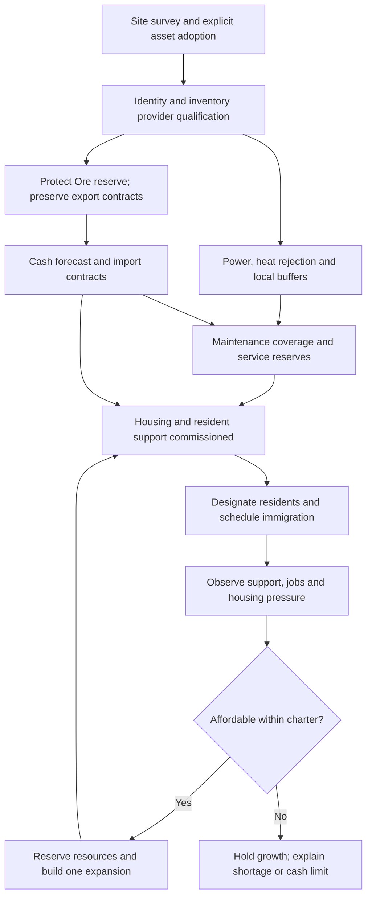
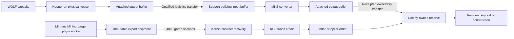

# Expanse Foundations — colony establishment plan

**Planning handoff · 2 October 2026 · GPT-6 Astra → GPT-6.1 Sol**

This is a design and read-only audit, not an implementation or a commissioning certificate. No game, save, installed DLL, facility, crew member, resource or account was changed. The direct instruction assigning this planning task to Astra supersedes the older ownership paragraph in the pasted prompt and AGENTS.md. Sol owns subsequent implementation. No other model was delegated work on this task.

## 1. Recommendation and first useful outcome

Build a **colony operating authority inside the existing app and save**, with a small number of real KSP buildings. Adopt Greater Flats first. Keep the existing industrial vessels; add a residential street of separate, low-part-count habitats. Automate their buffers, maintenance, supply purchases, exports and growth within a charter. Do not join the settlement into one giant vessel.

Use a hybrid model with explicit ownership:

* Existing MKS converters, WOLF hoppers and BRP keep ownership of their physical production. Expanse observes and transports their output; it does not simulate a second copy.
* New residential support, construction work, contracts and growth decisions use an Expanse save-backed simulation. New industrial simulation is a later opt-in conversion of a whole facility, never an extra multiplier on its live modules.
* Real habitats hold real named Kerbals. Roads initially provide a visual route and reserved corridor, not a vehicle/pathfinding simulation. Residents do not need to be spawned as walking EVA characters.
* The app is the management surface. A compact in-game maintenance window provides local checks and supported service actions.

**Smallest complete loop:** adopt the nine Greater Flats facilities → commission a service/storage hub and two small habitats → designate existing ordinary crew as residents and bring in a small new immigration group → keep support reserves funded and supplied → preserve the Ore export business → build one additional habitat only when housing pressure and the cash forecast justify it.

There are three early gates: persistent physical placement, resource transfers while a base is anchored/packed, and proof that physical production plus nearby logistics behaves correctly across loaded/unloaded transitions. Failure at one of these gates changes the design; it must not be hidden with free resources or inferred production.

## 2. Evidence and confidence

The evidence folder is `outputs/colony-plan-20261002` in the workspace. It contains a copied save, parsed site/part/resource data, decoded delivery state, installed hashes and decompiled installed methods. The audit scripts only write workspace evidence. Installed source/config files were read directly.

Evidence labels used below:

| Label | Meaning |
|---|---|
| **Verified snapshot** | Present in the copied save or installed file; not a claim about present live behavior. |
| **Verified code** | Behavior follows from inspected source or the installed assembly; conditions still matter. |
| **Previously demonstrated** | Existing evidence records an earlier in-game result; not repeated during this task. |
| **Implemented, not demonstrated here** | A code path exists, but this task did not exercise it in game. |
| **Proposed** | New behavior Sol must build and verify. |
| **Unknown** | Evidence is insufficient; commissioning must resolve it. |

Audit snapshot: save `C:/Kerbal Space Program/saves/The Expanse/persistent.sfs`, saved **2026-10-02 05:55:07 UTC**, UT **1,741,470.5387**, 59 vessels. SHA-256 `3b4457313d098b702a2deb6016b4cdba2d7629b2e93e4c1f220902a11b4e63e4`. The copied file is the audit authority. KSP was running during inspection, but the companion Host was not: its read-only snapshot pipe timed out, and only the WOLF admin pipe was present. I did not start services or submit commands. This is **not fresh live telemetry**.

Installed bridge hash matches the 20261002-045716 installation record: `23C788F5249277D9ECFAD6E668E6B93884760F3DFED3849F6AA00D3E05F786B6`. This verifies installed bytes, not which bytes a running process has loaded. Installed tracking/foundation hashes are retained separately; current source changes are not automatically treated as deployed.

### Actual Greater Flats assets

These nine coordinate-near facilities form a candidate physical colony, approximately 283 m east–west. Biome is not colony identity: remote bases on the same body must remain distinct. Offsets below are approximate from 3°N, 3°E using a 60 km Minmus radius, not surveyed building footprints. Nominal prefab seats are not certified habitation; deployable habitat capacity needs runtime inspection.

| Facility | Parts | Crew | Nominal seats | Approx. E/N metres | Adoption purpose |
|---|---:|---:|---:|---|---|
| Pioneer + PDU | 13 | 5 | 5 | 1 / 0 | Administration, logistics distribution, power |
| Agriculture | 11 | 3 | 4 | 11 / 0 | Existing Duna agriculture and buffers |
| Untitled Space Craft | 3 | 4 | 4 | 105 / 0 | Two Duna PDUs; assign a meaningful facility label |
| Manufacturing Hoppers 1 | 28 | 1 | 1 | 199 / 0 | Four manufacturing hoppers and storage |
| Polymers | 15 | 4 | 7 | 208 / −28 | Refinery and Tundra Workshop250; service candidate |
| Tundra Power | 7 | 3 | 4 | 230 / −16 | Power production/distribution |
| Hoppers | 23 | 0 | 2 | 239 / 0 | Three raw-resource hoppers and storage |
| Ag Support | 16 | 3 | 5 | 245 / −26 | Fertilizer support and three containers |
| Hoppers 2 | 34 | 0 | 3 | 283 / 0 | Four additional raw-resource hoppers |
| **Candidate colony** | **150** | **23** | **35** | | |

All 23 aboard are ordinary non-veteran Kerbals in the save. Their names, traits and vessel assignments are preserved in `site-summary.json`. Existing crew are **not automatically permanent residents**. Most seats are work/control seats, and 35 seats does not mean 35 acceptable homes. The proposed colony must account for visitors' support demand as well as residents.

Separate sites: **Minmus Mining** at approximately 0.998°N/0.998°E has 71 parts and four crew; **Minmus Mining Large** at 1.997°N/1.999°E has 61 parts and six crew. Colony PDU and Hopper near 70°N are also separate. Approximate distances from Greater Flats are 3.0 km and 1.5 km respectively for the two mining sites; require deliberate supply links, not silent biome-wide pooling. Five saved Resource Lodes are not buildings to adopt.

### Saved stock and operating evidence

| Resource | Greater Flats saved amount | Capacity | Interpretation |
|---|---:|---:|---|
| ElectricCharge | 136,336.55 | 151,852.81 | Distributed batteries; no proof of shared supply or EC/s margin |
| Supplies | 10.37 | 600 | Physical inventory, not evidence of current resident consumption |
| Fertilizer | 1,042.75 | 128,600 | Distributed stock, accessibility must be checked |
| Machinery | 135,661.14 | 262,225.00 | Installed plus reserve; never treat all as freely exportable |
| MaterialKits | 18,497.74 | 128,450 | Candidate construction input, subject to ownership/reserve checks |
| SpecializedParts | 4,893.71 | 128,450 | Same qualification |
| Gypsum | 3,447.22 | 256,000 | Physical stock |
| Substrate | 17,605.99 | 129,200 | Physical stock |
| Water | 30,338.22 | 160,600 | Physical stock |
| Minerals | 8,126.59 | 128,000 | Physical stock |
| Metals | 2,371.44 | 128,000 | Physical stock |
| Polymers | 263.49 | 128,000 | Physical stock |
| Chemicals / Ore | 0 / 0 | No tanks observed | WOLF Chemicals is not physical Chemicals; Ore is at the mining sites |

Ag Support has one converter activated and two inactive; Agriculture's agriculture converter is activated; Polymers has one refinery converter activated and its workshop converter inactive; all eleven observed hoppers are activated; Tundra Power's converter is activated. **Activation is not throughput.** No reliable current per-resource net rates, heat margin, nighttime margin or supply coverage were established by this offline inspection.

WOLF has established depots at Midlands and Greater Flats. Selected Greater Flats **capacity**, incoming / outgoing / available: Power **85 / 45 / 40**, Water **100 / 0 / 100**, Substrate **30 / 0 / 30**, Gypsum **30 / 0 / 30**, Minerals **100 / 0 / 100**, Chemicals **50 / 0 / 50**, Metals **50 / 0 / 50**, MaterialKits **50 / 0 / 50**, EngineerCrewPoint **10 / 1 / 9**, Maintenance **10 / 1 / 9**, LifeSupport **10 / 0 / 10**. These are saved values, including prior deliberate administrative additions. Do not relabel them as physically constructed facilities or spend them as cargo.

### Delivery business

The copied save has **10,426,390.22 funds**, decoded delivery revision **51**, no active shipments or economic faults, and an enabled automatic Ore rule using route v2: **1,000 Ore, 100 funds/unit, 64,800 seconds travel**. Route v1 at 500/unit remains in history. Fuel resupply is enabled for 1,000 LiquidFuel + 500 MonoPropellant + 1,400 Oxidizer, with **302,400 seconds (14 Kerbin days)** travel and a 21,600-second repeat interval.

Later evidence from the preceding task records revision 53 and two Ore dispatches after this saved snapshot. Those observations are **later than the on-disk save**, not evidence that the shipments disappeared. Reconcile with the next loaded save before commissioning; never recreate shipments from old screenshots or Host history. The prior task also recorded fuel shortages; full-manifest readiness must be refreshed. This planning task neither repaired nor recreated an order.

Preserve immutable departed terms. New configurable whole-unit batches pay 100/unit. Receipts previously demonstrated payment of the old 500/unit cargo. Revenue from cargo in transit is a receivable, not available cash. The 100/unit Ore contract is an explicit gameplay contract: the installed Ore resource's ordinary unitCost is **0.02**, so stock vessel recovery would not naturally pay 100/unit.

## 3. Installed systems: what they actually provide

| System | Evidence / conclusion | Design consequence |
|---|---|---|
| MKS, USITools, Konstruction | Version files 112.0.1.0; assemblies and patched part catalog present | Use actual patched parts, not remembered recipes |
| USI Life Support | No LifeSupport assembly found; no life-support save scenario; KSP.log line 1014 skips BRP USILifeSupport integration because dependencies are absent | **Not active.** MKS Supplies production does not establish hunger/habitation enforcement |
| BRP | Installed 0.2.7, processor records in save; USI.cfg maps USI_Converter/USI_Harvester to background adapters with prepared recipes | Background physical production exists; correctness for every hopper, logistics transfer and anchored state needs testing |
| WOLF | Installed registry, hoppers, virtual capacity and existing administration channel | Keep capacity separate; admin edits remain labeled sandbox controls |
| KPBS / SSPXR | Installed habitat/support parts; KPBS 1.6.16, SSPXR present | Candidate physical housing; prefab cost is not delivered/commissioned cost |
| KIS / KAS / stock EVA construction | Installed tools for assembling/connecting individual parts | Useful repair fallback, not proof of automated town placement |
| Konstruction | Fabricator, orbital shipyard and GroundKonstructorModule class present; **zero patched parts expose GroundKonstructorModule** | Ground assembly is a useful implementation reference, not a working colony construction service |
| EL / Ground Construction | No corresponding installation found in audited mod inventory | Compatibility configs in other mods do not install these systems |
| Boring Crew Services | Version 1.2.0 installed | Candidate future transport adapter; no verified integration with Expanse resident identity or receipts |
| Expanse Foundations | Holds surface pose and deliberately keeps anchored loaded vessels packed; saved membership and guards exist | Excellent stability basis; does not place buildings or create residents |
| Expanse companion | WPF app, Host, Domain, bridge; production/resource and power views, WOLF admin, depots and recoveries exist | Extend these components; do not make the website a second live colony manager |

### Warehouses and maintenance, precisely

Installed `ModuleLogisticsConsumer` requires eligible receiving storage **on its own vessel**. Non-EC buffers participate through enabled `USI_ModuleResourceWarehouse` parts with flow enabled. Ordinary scavenging range is **150 m**, logistics checks every **5 seconds**; it pulls below **50%** and pushes outputs above **85%**, in nominal 10%-capacity chunks. A qualifying piloted distribution hub can extend reach through its configured range; inspect actual part configuration and runtime reach before declaring a link.

Therefore separate buildings are possible, but **each converter building needs its own input/output buffers**. A WOLF hopper is a USI_Converter subclass and needs physical output storage reachable through its vessel resource flow; a distant warehouse is not automatically an output tank. Hoppers → attached tanks; agriculture support → attached input/output tanks; logistics moves stock **between** those local buffers. No need for every building to be docked together. A candidate material transfer must verify both endpoints and the specific logistics mechanism. Power uses coupler/distributor logic, not ordinary warehouse sharing.

Machinery, EnrichedUranium, DepletedFuel, Construction and ReplacementParts are blacklisted from ordinary scavenging. Installed field maintenance pulls Machinery/EnrichedUranium and pushes DepletedFuel/Recyclables. It sources reserve tanks rather than draining other converter machinery; regional maintenance supply lookup uses **150 m**. EVA maintenance accepts a Kerbal with **RepairSkill** (engineer/mechanic).

`ModuleAutoRepairer` is different: it checks **Engineer trait in the workshop part itself**, runs on its flight FixedUpdate approximately once per **21,600 seconds**, finds repairable parts within its default **2,000 m**, and invokes their maintenance. The serviced part still obtains reserves through its regional lookup. A Mechanic is not an automatic substitute for this exact Engineer check. The Polymers vessel has an installed Tundra Workshop250 and its patched part has ModuleAutoRepairer; runtime part-seat assignment and servicing remain to be verified. The workshop's manufacturing recipe being off is not the auto-repair switch. No proof here establishes auto-repair while unloaded or held packed.

MKS output depends on configured recipes, bonuses/governor, machinery and skills; saved crew count cannot certify production. WOLF EngineerCrewPoint is virtual labor capacity, not an onboard engineer. Keep WOLF Maintenance, physical machinery service and proposed resident jobs distinct.

### Background and observation limits

Current ColonyObservation scans at most 128 vessels / roughly 1,024 parts, rejects a vessel beyond 160 parts, and displays at most 24 colony vessels, 24 tank states and 12 converters per vessel. It groups by body/biome and recognizes USI/MKS/WOLF modules, so a new pure habitat could be omitted. This cannot remain the colony registry. Paginate declared facilities separately from discovery, preserve partial/unknown flags, and avoid making absent rows mean absent equipment.

Current power measurement intercepts accepted KSP resource requests, excludes direct writes such as USI PDU transfers, and requires loaded/unpacked operation. The on-rails estimate only sums active **converter** recipe ratios on loaded/packed vessels; it excludes other generator types and is not guaranteed output. Keep measured, nominal and unavailable states. Add provider coverage and measured interval to drill-downs before using power for admission decisions.

The existing remote BRP inventory gateway rejects loaded vessels; the active BRP path requires its supported active/unpacked context. **Loaded + anchored/packed is a material-transfer gap.** Do not unanchor a building or ask the user to leave the colony as the final solution. The first implementation must add and qualify a provider for that state, or explicitly queue at a safe provider boundary with visible delay. Permanent resident support must not depend on a transfer path that can remain blocked while the user watches the base.

## 4. Product flow and placement

### Establish colony here

1. **Choose site:** select coordinates/map point, name and intended footprint. Show biome/WOLF depot, nearby vessels, protected lodes and landing areas. Read-only terrain survey provides heights, normals, slope, clearance and uncertainty. Do not infer a safe site from the biome's name.
2. **Adopt assets:** list candidate vessels with identities, ownership, distance, staffing, providers and confidence. User selects the set once; the planner proposes buffers/service links needed for that set. Existing stock and crew remain in place.
3. **Charter:** purpose, permanent-resident target, visitor allowance, construction envelope, minimum cash, per-period spending, growth ceiling and approval mode. Show current 23 people separately from a 12-resident example. Default growth requires approval until commissioning passes.
4. **Founding plan:** itemized adoption work, housing, imports, labor, construction stages, initial and peak power, reserve coverage, committed cash, first export receipt and downside case. Unsupported providers or unverified placement block approval of dependent work, not the entire read-only plan.
5. **Approve:** freeze versioned scope, maximum expenditure and policy. Later price/stock/site changes require a re-quote; approval is not permission for unlimited future growth.
6. **Build and commission:** show Reserved → Supplying → Building → Placement ready → Commissioning → Operational. Always state the next blocker and who can resolve it. Construction elapsed time alone does not certify a building.
7. **Manage:** one colony overview of people, housing, reliable support coverage, power, cash, deliveries and the next decision. Drill into actual facility/provider evidence.

### Residential street

Keep the current east–west industrial strip. Propose a parallel **8 m visual corridor north of it**, with three initial habitat plots and an expansion plot on each side. Use planning envelopes, not final surveyed locations: 20–30 m habitat-center spacing, service/storage near the center, an industrial link at the east end, and an independently surveyed landing area beyond the pedestrian district. Preserve emergency/rover clearance and radiator/solar deployment envelopes. A lander exclusion zone must be sized to the actual vehicle and engine effects; a drawn 100 m circle is not safety certification.

The accompanying mockup has a measured approximate asset map plus a separate schematic future street. Do not relocate an existing vessel merely to make the illustration symmetric. The east stock/service group is over 150 m from Pioneer/Agriculture; bridge the supply path deliberately or install local buffers/service stock. New roads initially use low-cost surface markings or a small number of static visuals; no dozens of physical road-segment vessels. Static/PQS integration remains an experiment. If that fails, use sparse non-colliding markers in a template and describe the road as visual.

### Recommended placement mechanism

Use **versioned, vetted .craft templates assembled through a dedicated Expanse placement adapter**, followed by Foundations anchoring and commissioning. Reuse KSP assembly facilities where appropriate. Do not call Konstruction's ground method blindly: its inspected code consumes resources before assembly, loads at a module transform and uses a stock launch path. It has no colony transaction/plot identity/rollback contract. Stock `AssembleForLaunch` can also set the active vessel. These side effects need an isolated experiment.

Alternatives: manual EVA/KIS assembly is a fallback but fails the desired low-tedium workflow; adding EL/Ground Construction would introduce a new dependency and still require placement/persistence integration; Konstruction's existing fabricator helps manufacture inventory parts, but is not an exposed ground-town builder. WOLF module absorption creates capacity, not visible persistent housing.

**Earliest experiment:** in a separate disposable development installation/save, place one uncrewed 6–12-part habitat/support template at a surveyed Minmus plot, 30 m from a reference base. Prove template load, complete connected attachment tree, generated unique vessel/part/flight identities, terrain-relative orientation, physics settlement, anchor handoff, scene exit/re-entry and save/load. Then interrupt each phase and replay the operation ID. Accept exactly one persistent building, no altered reference-base pose, no unexpected crew/stock/funds and no spontaneous active-vessel change. No live save or DLL deployment is included in this planning task.

Placement contract:

* Store body identity, geodetic center, heading and local footprint coordinates; calculate world coordinates at placement, not across floating-origin shifts. Sample the whole footprint and collider extents. Reject excessive slope, missing PQS/terrain, overlap and unsupported corners. Initial maximum slope **3° is a proposed template limit**, adjustable only by tested template certification.
* Use validated supports, battery, command/control and BASE classification; crew never substitutes for an unpowered command system. Persist a colony marker with facilityId/buildOperationId/template hash. Keep discovery robust across rename/docking and refuse ambiguous part ownership.
* Start uncrewed with explicit commissioned contents. Strip template fuel/crew defaults and charge every included resource. Do not clone saved part IDs, WOLF hopper IDs, depot memberships or anchor state. No copied template can silently subscribe to an existing hopper.
* Build one object at a time at 1× in a valid placement scene. Background work can finish while unloaded; final placement may wait for scene/terrain readiness. MVP UI must say **“Construction complete; awaiting placement window”**, not imply fully autonomous off-screen spawning. Later remote proto-vessel creation requires its own proof.
* Commission terrain/contact stability, stock/resources, deployed capacity, heat/power and identity before assigning crew or production. Adopt Foundations only after stable placement, never as a way to conceal intersecting colliders.
* Adoption records identities and capability evidence without moving/deleting hardware. Replacement first commissions new capacity, transfers residents and protected cargo, then retires the old facility. Removal never destroys an occupied building; uncertain operations quarantine the plot and require reconciliation. Salvage rates are explicit policy, not full refunds by default.

## 5. Facility packages and dependency graph

Every template manifest carries a hash, patched-part dependencies, footprint/deployment envelopes, nominal seats and certified homes, module ownership, bill of materials, labor, build duration, power/heat demand, local buffers, transfer providers, installed machinery, reserves and service requirements. Costs are recomputed against actual part variants/TweakScale; names and nominal dimensions alone are insufficient.

| Package | Inputs → outputs | Required local hardware and support |
|---|---|---|
| WOLF extraction adoption | Allocated WOLF recipe + physical EC → physical raw stock | Keep hopper, attached output tank, command and battery; verify depot/recipe/hopper identity. Remote capacity is not output stock. |
| Fertilizer support adoption | Selected gypsum recipe + EC + machinery service → Fertilizer and any configured byproducts | Local Gypsum/Fertilizer buffers, enabled warehouse/flow, machinery installed/reserve, staff according to recipe. Read exact recipe coefficients during commissioning. |
| Agriculture adoption | Substrate + Water + Fertilizer + EC + Machinery → Supplies/Recyclables for Cultivate(S) | Local buffers for all required materials and output; verify runtime recipe, efficiency, power and service. Existing activation gives no guaranteed daily yield. |
| Service hub | Qualified labor + reserve Machinery/fuel + EC → maintained facilities | Engineer in actual auto-repair part for legacy mode; storage positioned within serviced-facility supply range. Proposed scheduler service needs a separate provider qualification. |
| Housing block | Certified homes + resident supplies/utility allocation → supported residents | Real crew seats, command, battery, support interface, evacuation capacity, door/IVA access, safe deployed supports. Prefer small KPBS habitat package first; unlocked tech and deployment verified. |
| Trade/store hub | Inbound manifests / physical transfer → available reserved cargo | Capacity by resource; commodity-specific mass/volume; receipts; delivery berth/virtual freight allocation. No undifferentiated infinite warehouse. |
| Power support | Fuel/solar exposure + maintenance + heat rejection → EC/utility service | Actual compatible generator, radiator, buffers, coupler/distributor coverage and outage allowance. WOLF Power is a separate input only to WOLF operations. |





Minmus's snapshot has enough *nominal* MaterialKits/SpecializedParts to make adoption attractive, but commissioning must exclude allocated stock and prove transfer access. The first stage need not manufacture Chemicals, Machinery or every advanced construction resource locally. Import missing certified components and service supplies while evaluating local production.

## 6. Resource authority and proposed data model

One unit can occupy exactly one ownership account. An observation is never a second account.

| Ledger | Authority | Permitted treatment |
|---|---|---|
| Physical stock | KSP PartResource + qualified BRP state for that endpoint | Observe; reserve claims; debit/credit through a provider with before/after witnesses |
| Colony-owned stock | New save-backed quantity account, bounded by warehouse capacity | Receives only a receipted physical debit, purchased delivered cargo, or one authorized colony production job |
| WOLF capacity | WOLF depot registry | Allocate ongoing recipe capacity; never sum with tank units |
| Physical EC | KSP/BRP electrical modules | Do not mint EC from WOLF Power or sum separated batteries as a grid |
| Colony utility service | Proposed power-budget contract for colony-owned facilities | Must be supplied by a dedicated simulated utility or a qualified physical service adapter; separate label from EC |
| Funds | KSP Funding | Debit purchase/construction/service contracts; credit recovery under immutable shipment terms; app reservations are commitments, not a second balance |
| In-transit/escrow | Saved operation/shipment ownership | Exclude from spendable source and destination inventory; retain until committed, returned or reconciled |

First release should keep adopted physical plants in **physical ownership**. New resident support uses a proposed Expanse support policy, clearly labeled because USI-LS is absent. Use a small dedicated support/power template under colony ownership or qualify a physical utility adapter. Do not claim that an unsupported PDU measurement certifies an entire residential grid. Enabling USI-LS later requires an explicit migration: stop the Expanse consumer for those same Kerbals/resources before enabling the alternative. No silent installation or retrospective hunger penalty.

Construction materials may be escrowed from physical inventory once through the provider, then held in a colony construction account. Colony stock materialized back into a tank must debit its account and credit physical stock in a single reconciled operation. A UI “total resources” view shows owned, observed external, reserved, in transit and inaccessible columns separately.

**Proposed records** (stable IDs, versioned schema, references by ID rather than display name):

| Record | Essential fields |
|---|---|
| Colony | colonyId, worldId, name, body/site boundary, charterVersion, operatingMode, simulationUT |
| Charter | resident/visitor targets, growth ceiling, spending envelope/period, cash floor, reserves, approval mode |
| Facility | facilityId, vessel/part bindings, templateHash, plotId, ownerMode, provider capabilities, commissioning status |
| Plot | terrain survey revision, body-relative transform, footprint, exclusion/utility links, reservation state |
| Template | part/config fingerprint, recipe/profile, BOM, labor, duration, buffer/service/power requirements |
| Inventory account | accountId, resourceId, owner/provider, quantity micro-units, capacity, reservations, observation confidence |
| Resident | residentId, KSP roster binding, name, actual trait/skill, home, workplace, resident/visitor/migrant status |
| Job | skill, shift/work allocation, capacity, actual crew-placement constraint, wage/service cost, facility |
| Construction order | stable operationId, plan/version/hash, escrow, work completed, plot/template, build marker, phase, fault |
| Supply contract | supplier stock/service envelope, manifest, freight slots/mass, quote/lead time, immutable price, payment phase |
| Colony policy event | demand trigger, candidate investment, rejected alternatives, reserve/cash forecast, approval |
| Receipt | world/branch/epoch, operationId, sequence, before/after quantities, entity markers, outcome, compaction witness |

Keep resident identity separate from names (renames happen) and enforce a one-to-one roster binding. KSP's actual seat assignment controls effects requiring physical presence; an app job label cannot grant an Engineer bonus from another building. Recruitment creates or selects actual roster Kerbals through a new tested bridge operation, assigns them once upon passenger arrival, and never changes orange-suit roles by default. Visitors count toward support and emergency capacity even if they are not eligible for automatic resident jobs.

## 7. Economy, reserves and growth

Reliable support means every required service/resource has qualified capacity and an achievable replenishment plan under a downside forecast. Missing information yields **“Not commissioned”**, not green sustainability.

For each commodity, use `inventory position = usable on hand − reservations + confirmed arrivals before need`. Reorder when forecast use over supplier lead time + scheduling delay + safety margin exceeds that position. Do not count late or blocked inbound orders as coverage. Cap order quantities by free receiving capacity and freight mass/volume. Installed densities matter: Ore is 0.010 t/unit, so 1,000 Ore is 10 t; MaterialKits 0.001, Machinery and SpecializedParts 0.00378 t/unit. Freight cannot be modeled as unlimited interchangeable unit slots.

Supplier contracts require stock or explicitly purchased production capacity, a replenishment rule, quote expiry, travel time, freight capacity and payment terms. Default proposal: reserve funds at approval, debit goods/freight at dispatch, recognize cargo only on arrival. Deposits/refunds/failed delivery are versioned terms; no unlimited free Kerbin vendor. Local deliveries require a proven endpoint or colony-owned receiving warehouse, not arbitrary additions to any tank. A source needs physical readiness even if its displayed balance is large.

Export limit: dispatch only whole configured batches after retained construction/service/resident reserves and prior cargo reservations. Preserve existing Ore contracts initially; any new freight constraint applies prospectively and must not strand already-departed cargo. Existing code does not establish a global freight fleet or labor/material import market; these are proposed additions.

Cash forecast uses actual funds minus commitments and cash floor, then timed receipts/expenses. Receivables cannot fund a purchase before arrival. A colony allocation does not create a second bank account; other game purchases can reduce uncommitted headroom and pause colony orders. Adopted infrastructure is sunk capital, not free new construction or a refund.

Make/import decision: compare installed capital + delivery/build delay + power + staffing + machinery/maintenance + replacement + opportunity cost against avoided landed imports over a chosen horizon. Existing agriculture gets a measured trial before expansion. A positive projected daily margin does not overcome an immediate cash or freight shortage.

### Worked founding example — illustrative, not a quote

This is a **12-resident reference case**, not the current 23-person base. Real commissioning includes all people present. Recommended first population exercise designates ten consenting existing ordinary crew and recruits two ordinary newcomers, while explicitly budgeting support for remaining visitors separately. No crew is removed to fit the example.

Assumed Expanse support policy: 10 Supplies/person/Kerbin day; this is a new balancing parameter, **not USI-LS's active rate**. Initial stock 2,400 Supplies (20 days), reorder at 960 (8 days); replenishment lead time 3 days and batch 1,200. Housing targets 16 certified homes initially, with four held vacant: a candidate arrangement is four 4-seat KPBS modules in two building packages, subject to actual deployment and home certification. Work seats elsewhere do not increase certified homes. The common house in the sketch is optional later scope. Service kit BOM is provisional: 6,000 MaterialKits and 300 SpecializedParts drawn from qualified existing stock, not simply deducted from displayed totals. Initial support purchase includes 50 Machinery reserved for service. Construction consumes 48 engineer-hours over at least two Kerbin days with four qualified workers; these are design assumptions pending measured template costs/work rules.

Funds example: ring-fence a **500,000** operating allocation inside existing funds; hold a **200,000** cash floor. Initial setup contracts consume **150,000** (labor, delivered housing hardware, utility kit, transport, initial Supplies/Machinery; illustrative package quote, no duplicate materials charge). Initial materials drawn locally are separately reported as an opportunity cost. Operating costs **3,000/day**, replenishment **6,000/batch**, expansion **80,000**. Assume—not measure—1,000 exportable Ore/day, 100/unit, three-day lead time and up to three simultaneous 10 t export slots, plus a separately funded 5 t inbound slot for support freight. A 1,200-Supplies batch weighs 1.2 t; initial housing freight needs its own quoted capacity. Export revenue starts on day 3. Without validated output/freight, these figures cannot approve growth.

| End of relative day | Cash available in example allocation | Supplies | Events |
|---|---:|---:|---|
| 0 | 350,000 | 2,400 | Pay setup; local construction materials escrowed separately |
| 2 | 344,000 | 2,160 | Two days of work/support; no sale cash received yet |
| 3 | 441,000 | 2,040 | First 100,000 sale receipt |
| 6 | 732,000 | 1,680 | Four completed export receipts total |
| 12 | 1,308,000 | 960 | Ten receipts; pay 6,000 replenishment dispatch |
| 15 | 1,599,000 | 1,800 | Replenishment arrives after three more days' consumption |
| 18 | 1,810,000 | 1,440 | Sixteen sale receipts; pay 80,000 expansion commitment |

Arithmetic: day 18 cash = 500,000 − 150,000 − 54,000 − 6,000 − 80,000 + 1,600,000. Supplies = 2,400 + 1,200 − 18×120 = 1,440. This intentionally exposes how generous the custom Ore contract is. In a **zero-export** case, day 18 cash is 290,000 without expansion, and support still works through this horizon; continued spending eventually approaches the floor, so growth remains off. If imports are delayed beyond the eight-day reorder cover, pause arrivals and nonessential work before reserves run out. Existing 10.37 physical Supplies would cover only about 52 game minutes for 23 people under this *proposed* 10/day rule; **do not activate it on existing crew without funded startup reserves**.

Growth proposal: trigger housing planning at 80% certified-home occupancy or funded arrival reservations crossing that level. Require positive downside cash through the construction/import horizon, support reserve coverage, utility headroom, jobs and workforce availability, free plot and charter ceiling. Re-evaluate at completion before immigration. Costly imports may trigger an agriculture proposal, not automatic construction merely because a part is unlocked. Persistent shortages hold immigration/expansion, shed discretionary industry, order emergency support, and propose voluntary departure/evacuation. First release has no automatic death, births, families or hidden forced dismissal policy. Later family simulation is separate.

## 8. Persistence, transactions and background execution

Keep authoritative colony state **inside the selected KSP save**, coordinated with recovery/depot state. The Host plans and presents; it cannot retain a newer colony after a quickload restored an older world. Save/world, run/epoch and branch identity gate every command. On reconnect, reconcile against the selected save before issuing work.

Extend the existing receipt discipline, not merely its DTO collection. Current recovery state has a **36 KiB state / 48 KiB encoded bound**, 32 receipts and 32 active shipments; ordinary depot registration permits eight active depots. The new colony cannot be stuffed into those limits unchecked. Propose a versioned colony scenario/capsule coordinated through a single main-thread transaction coordinator, with bounded chunks and cross-ledger operation references. Migration, save integrity and compaction are prerequisites. Keep detailed audit history in a derived Host archive; retain enough save-backed witnesses/tombstones to prevent replay. Measure actual bytes with worst-case data and reject oversized plans explicitly.

```mermaid
sequenceDiagram
 participant App
 participant Planner
 participant Save as Save authority
 participant Stock as Qualified stock provider
 participant Place as Placement adapter
 App->>Planner: Approved plan/version, budget, plot
 Planner->>Save: Validate epoch; reserve operation ID and budget
 Save->>Stock: Preflight exact resource deltas and provider state
 Save->>Save: Persist prepared intent / fault recovery witness
 Save->>Stock: Debit into construction escrow; verify readback
 Save->>Save: Commit escrow receipt; advance work on game UT
 Save->>Place: At ready scene, build once with operation marker
 Place->>Save: Vessel/part IDs, pose and commissioning evidence
 Save->>Save: Commit facility; consume escrow; free reservation
 Save-->>App: Operational or explicit blocked/reconcile state
```

No blanket rollback after an uncertain external effect. If creation may have occurred, search its persistent operation marker, bind exactly one matching object or hold for reconciliation; do not spawn again. If a debit may have happened, compare witnesses before refunding. Duplicate markers, changed membership, missing parts, crew conflicts or mismatched balances hold the action. Resource escrow is refundable only when non-application/cancellation is proved and the destination can receive it. Each physical placement/resource/funds/crew effect gets failure injection before and after mutation. A durable file save is still controlled by KSP save operations; receipts in memory alone do not survive a process crash. Document and test the recovery point rather than promise impossible cross-process atomicity.

Background rules: use KSP UT, never wall time for production/travel/work. Pause accrues nothing; warp advances to supply exhaustion, job completion and delivery events in chronological order. Bound catch-up work and display its watermark. No unbounded per-tick replay. The in-game bridge must own or resume the scheduler so closing the app does not stop future colony operations; current Host-coordinated delivery scheduling is not a promise of app-independent operation. Closing KSP stops game time; reopening catches up only to the loaded save's UT. Unavailable physical inventory holds that transfer; a colony-owned reserve can continue support without inventing physical stock.

Separate simulation modes per facility. Existing physical/BRP facilities remain physical through unload. Colony-owned templates use passive/disabled duplicate converter modules and one saved simulation owner. Migration is an explicit quiesce → capture → deactivate old owner → transfer authority → validate operation; no mixed mode during ambiguity. BRP must not also process a colony-owned facade. A disconnected app or lost measurement does not change ownership.

Proposed performance acceptance targets, measured on this machine: ordinary observer/scheduler incremental main-thread work p95 ≤1 ms and p99 ≤3 ms at 100 facilities / 200 residents; ≤10% frame-time regression at the same scene/warp, compared with the current baseline; paginated observations instead of a world rescan each frame; cached patched-part catalog invalidated by mod hash. Routine event catch-up bounded to 100 events per frame/time slice; expose backlog if exceeded. Placement is exceptional and separately measured: profile 6–12-part templates, reject synchronous multi-building bursts, and record worst hitch rather than count it as routine budget compliance. The initial physical milestone targets two habitats + one service package + one expansion and no more than about 40 added parts, subject to certified templates. These are targets, not measured performance guarantees.

## 9. Interface design and why previous layouts fail

The accompanying `design-review.html` is a standalone **design mockup**, not an app implementation. It includes the app overview, founding review, residents, construction, maintenance, finance views, a site sketch and the compact in-game window, with annotations and explicitly illustrative values.

Existing owned UI uses mixed approaches: DepotWindowAddon inherits default GUILayout styles inside a 460×620 window with four fixed-height scroll areas and unconstrained label/button rows; FoundationWindow mixes custom font sizes with fixed 450-pixel width; TrackingWindow uses absolute Rect layouts, GUI.matrix scaling, fixed rows and label fitting. Those choices risk font/padding mismatch, stale calculated dimensions, long-label overflow and nested scrolling. Source inspection identifies those risks, not proof that every historical screenshot came from one line. Tracking's stock/third-party overlays and map camera projection are separate issues from maintenance-table layout.

**In-game proposal:** one Expanse Maintenance window, flat neutral gray, 760×480 logical pixels by default, clamped to the viewport; simple tabs **Facilities / Machinery / Staffing / Power / Inputs / Service log**. Shared measured column widths; header remains outside the scrolling body; 28-pixel minimum row height grows for wrapped detail. Names use ellipsis with full tooltip and expandable detail. Numeric quantities right-aligned; no multiline text inside fixed-height buttons. At narrow sizes hide secondary columns behind details rather than shrinking text to illegibility. Detail/action footer has its own measured layout and never draws over table rows. Scale once through a single coordinate system; recalculate fonts, row metrics and bounds on scale/resolution change. Scroll tabs horizontally if necessary.

A row shows facility identity, loaded/packed/unloaded provenance, last successful service, installed Machinery versus accessible reserve, qualified assigned staff, power coverage, missing inputs and next action. **Service now** appears only for a qualified adapter in its supported context. Auto service, EVA/manual service and unavailable service have different labels. Queueing a new background service is a proposed operation, not an alias for clicking an unsafe PartAction event. No unsupported action is enabled just because the module exists.

Expanse owns its foundation/depot/maintenance windows and app. It does **not** own MKS/WOLF/KER/stock windows; matching their visual structure does not authorize replacing or hiding them globally. Compatibility work can offer one Expanse view of their data and suppress only an explicitly integrated duplicate window when appropriate. Third-party windows need explicit adapters/patches and their own regression tests.

**App proposal:** retain Colony / Depot stock / Delivery setup / Activity. Inside Colony use Overview, Site & construction, People & jobs, Production, Power, Inventory & WOLF, Trade, Maintenance, Finance & policy. Preserve existing power/production drills and pinned headers; show local versus external supply, stale evidence, demand forecasts and dispatch blockers directly on the relevant page. Overview cards answer “people supported?”, “cash runway?”, “what needs action?”, “what builds next?”. Founding review has a dependency queue and approve-budget action; site view has plotted assets/plots, not a marketing illustration presented as live coordinates. All form drafts survive telemetry refresh. No transit rows must be followed by explicit automatic-order states: waiting for stock, provider unavailable, freight full, cash reserve protected or schedule not due.

Layout acceptance: in-game at 1280×720, 1920×1080, 2560×1440 and 3840×2160, at supported 75/100/125/150% scales; app at 860×680 minimum and larger, Windows DPI 100/150/200%. Test long names, 0/1/200 rows, huge quantities, missing data, errors, narrow filters and simultaneous mod windows. Pixel inspection and hit-target tests are required. No overlap, no lost primary action, visible scrollbars, stable column alignment, keyboard navigation/focus preserved. Automated geometry checks supplement actual rendered screenshots.

## 10. Staged backlog for Sol

Stages are dependency gates, not calendar estimates. Avoid a large parallel implementation before proving the first two.

| Stage | Scope / dependencies | Acceptance and stop condition |
|---|---|---|
| **P0 — feasibility** | Isolated placement experiment; loaded/packed inventory and BRP/logistics/maintenance matrix; read-only asset/crew/provider inspector | Exactly one persistent uncrewed building after replay/load; no movement of old base; supported transfers across required states; measured background behavior. Stop and revise unsupported ownership assumptions. |
| **P1 — adoption and contracts** | P0 findings; explicit colony/facility IDs, audit provenance, manifests, survey/plot records, capability versions; current app adoption view | Nine candidate assets adopted without moving hardware or altering crew/resources; remote mines distinct; pure habitats remain visible; partial observations never erase facilities. |
| **P2 — authoritative colony ledger** | P1; schema/migration, unified effect coordinator, escrow/reservations, branch identity, receipt compaction, generic resource import/transfer/funds-debit contracts | Conservation invariants, byte bounds, duplicate delivery prevention, fail-before/after recovery, save/reload and quickload branches. Existing Ore v1/v2 terms/payment regression remains green. |
| **P3 — construction and support commissioning** | P0 + P2; template catalog, BOM/labor/work time, site placement, service/power/storage qualification, resident support policy | Build two certified homes packages and service hub in test colony with correct funds/materials; no free template contents; enough reserves before support enforcement; app shows placement waits honestly. |
| **P4 — residents and trade** | P3; home/job assignments, ordinary roster recruitment, passenger manifests, supplier/freight limits, reorder logic, protected exports | Existing 23 preserved; example ten residents + two newcomers tracked exactly once; all present people counted for support; imports arrive before exhaustion; no claims of on-site work while workers are elsewhere. |
| **P5 — first autonomous expansion** | P4; downside forecast, threshold policies, approval/automatic limits, cost comparison | One justified extra habitat built, staffed and persisted; growth refuses unaffordable/unsupported expansion; closing app, warp and scene changes do not duplicate or lose outcomes. |
| **P6 — product and load qualification** | Incremental UI work from P1; final compact maintenance dashboard and complete app drills, diagnostics/performance harness | Scale matrix passes with actual rendered UI; 100-facility model test and realistic physical scene baseline; installation/rollback package reviewed separately before live rollout. |

The first complete loop spans P0–P5; a static overview or a spawned habitat alone is not acceptance. Sol should deliver each stage with evidence and keep the live game unchanged until the separate installation/commissioning action is authorized.

**End-to-end acceptance scenario:** start from a copy of the audited save in the development installation; adopt the exact nine assets; preserve all original crew/resources; establish real housing/support; arrive with two ordinary residents; perform a measured physical-to-colony supply transfer; maintain reserves through three unloaded Kerbin days; settle one 1,000-Ore export at 100/unit after 64,800 seconds; show blocked fuel readiness; trigger and complete one affordable expansion. Quicksave/load before/after every externally visible effect, interrupt Host/bridge communication, repeat requests and restore an earlier save. Check that buildings, residents, cargo and funds match the restored branch exactly. Repeat with no export revenue and delayed imports: growth stops, shortages are legible, no negative or duplicate inventory.

Major risks: KSP spawn side effects/terrain stability; loaded anchored transfer gap; BRP prepared-recipe and WOLF hopper coverage; absent life-support enforcement; finite save/capsule limits; cross-module funds/crew callbacks; huge physical vessels/observer truncation; scale-sensitive UI. None is solved by increasing WOLF points. Families, births, city-scale EVA movement, road vehicle routing, general factory conversion and broad interplanetary colonization remain outside the first milestone.

## 11. Exact next implementation task and remaining decisions

**Next task for GPT-6.1 Sol:** “Implement P0 only in the isolated development environment: create a reusable, versioned uncrewed habitat template and a development-only placement probe; use KSP assembly APIs with an operation marker, terrain/clearance checks and Foundations handoff. Prove save/load/retry uniqueness and absence of scene/crew/resource side effects. In the same report qualify loaded-unpacked, loaded-anchored and unloaded-BRP resource transfer plus legacy maintenance. Return evidence and a go/no-go recommendation before building the full colony scheduler. Do not deploy to the live installation.”

No additional user decision blocks that experiment. Before actual founding approval, obtain only: **permanent resident target versus existing visitors; construction budget/cash floor; and consent to the proposed Expanse support policy versus intentionally installing/migrating to USI-LS.** Default to approval-required growth and preserve every existing resident/visitor until the user chooses otherwise. Exact street coordinates and template choice are engineering proposals produced by the survey, not questions the user must solve manually.

## Evidence index

* `outputs/colony-plan-20261002/audit.json`, `site-summary.json`, `part-catalog.json`, `resource-definitions.json`: saved vessel/crew/module/resource evidence and patched part definitions.
* `saved-ledger.json`, `WOLF_ScenarioModule.json`, `FoundationRegistry.json`, `DepotRegistryModule.json`, `installed-hashes.json`: distinct authorities and provenance.
* `ModuleLogisticsConsumer.cs`, `ModuleAutoRepairer.cs`, `FieldRepair.cs`, `LogisticsTools.cs`, `WolfHopper.cs`, `GroundKonstructorModule.cs`, `AbstractKonstructorModule.cs`: decompiled **installed** binaries, retained privately as audit evidence; ILSpy type-resolution warnings mean these are behavioral inspection, not rebuild sources.
* `C:/Kerbal Space Program/GameData/000_USITools/Patches/Logistics.cfg`, `.../AddConsumers.cfg`, `.../BackgroundResourceProcessing/Config/USI.cfg`, `.../UmbraSpaceIndustries/Konstruction/Settings.cfg`; ModuleManager.ConfigCache is the patched-part source.
* `src/Expanse.WorldBridge/ColonyObservation.cs`, `ColonyPowerTelemetry.cs`, `RemoteBrpInventoryGateway.cs`, `BrpInventoryGateway.cs`, `RecoveryCapsuleModule.cs`, `EconomicRecoveryEffects.cs`, `WolfLedgerBridge.cs`, `DepotWindowAddon.cs`.
* `src/Expanse.Domain/AcceptedState.cs`, `AcceptedStateV2Draft.cs`, `LogisticsPlanner.cs`; `src/Expanse.Clock.Manager/MainWindow.xaml`; `src/Expanse.TrackingStation/UI/TrackingWindow.cs`; sibling `ExpanseFoundations/src/Records.cs`, `Hold.cs`, `Window.cs`.
* `docs/WOLF-COLONY-ADMIN.md`, `ANCHORED-BASE-INTEGRATION.md`, `ORE-EXPORT-DESIGN.md`: prior evidence and constraints, checked against newer code/save. Old first-release observation documents are not current feature inventories.

Token accounting is a separate task-scoped report generated from actual Codex response usage records, including cached input. Cached input is a subset of input; reasoning is a subset of output. It is not a billing or weekly-quota estimate, and the final response's own usage becomes available only after it is emitted.
